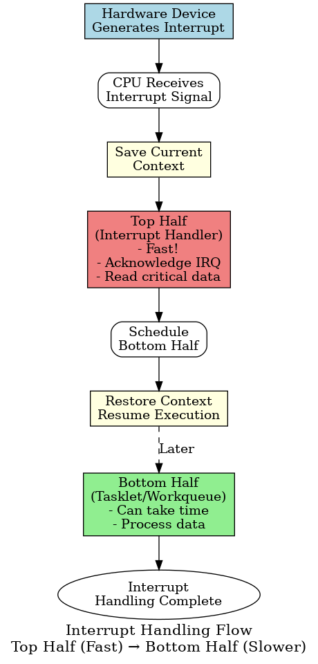
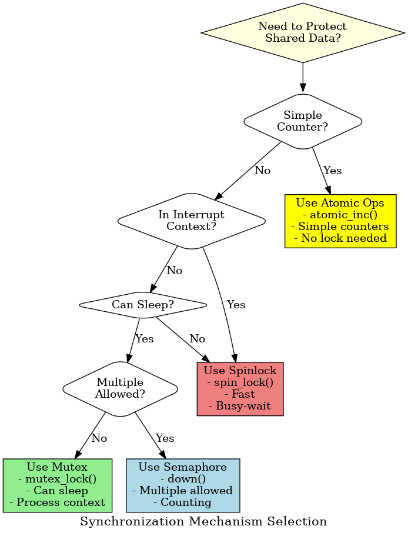

# 🎓 Complete Layman's Guide to Linux Driver Development

This guide provides simple explanations and analogies for all driver development concepts.

## 📚 Quick Navigation

Each chapter now includes a "🎯 Layman's Explanation" section at the beginning with:
- Simple analogies
- Real-world examples
- Visual flow diagrams
- Key concepts explained simply

---

## 🗺️ Learning Roadmap (Simplified)


```
START HERE
    ↓
1. Kernel Compilation
   "Learn to build the kernel"
   Analogy: Making your own pizza from scratch
    ↓
2. Embedded Linux
   "Linux in devices"
   Analogy: Food truck vs full restaurant
    ↓
3. Kernel Modules
   "Apps for the kernel"
   Analogy: Phone apps you can install/uninstall
    ↓
4. Device Drivers
   "Translators for hardware"
   Analogy: Language translator
    ↓
5. Character Devices
   "Practice with fake devices"
   Analogy: Flight simulator
    ↓
6. Platform Drivers
   "Built-in hardware"
   Analogy: Furniture already in your house
    ↓
7. Data Structures
   "Organizing data efficiently"
   Analogy: Different storage systems
    ↓
8. Interrupts
   "Hardware screaming for attention"
   Analogy: Phone ringing while reading
    ↓
9. Synchronization
   "Preventing chaos"
   Analogy: Bathroom door lock
    ↓
10. Memory Management
    "Careful memory handling"
    Analogy: GPS coordinates vs addresses
    ↓
11. I/O Access
    "Talking to hardware"
    Analogy: Mailbox systems
    ↓
12. Driver Model
    "Organization system"
    Analogy: Company org chart
    ↓
13. Debugging
    "Finding and fixing bugs"
    Analogy: Detective work
    ↓
14. Time Management
    "Timers and delays"
    Analogy: Kitchen timer
    ↓
15. USB Drivers
    "Hot-pluggable devices"
    Analogy: Conference call system
    ↓
16. GPIO/SPI/I2C
    "Common hardware interfaces"
    Analogy: Different communication methods
```

---

## 🎯 Key Concepts Explained Simply

### Kernel Space vs User Space
```
┌─────────────────────────────────┐
│   User Space (Your Apps)        │ ← Safe, protected
│   - Can crash without harm      │
│   - Limited privileges          │
├─────────────────────────────────┤
│   Kernel Space (Drivers)        │ ← Powerful, dangerous
│   - Full hardware access        │
│   - Bug = system crash          │
└─────────────────────────────────┘
```

**Analogy:**
- User space = Customers in restaurant (can't enter kitchen)
- Kernel space = Kitchen staff (full access, mistakes affect everyone)

---

### Device Types

**Character Device** = Stream of data (like water hose)
- Examples: Keyboard, serial port
- Read/write one byte at a time

**Block Device** = Chunks of data (like boxes on shelf)
- Examples: Hard disk, USB drive
- Read/write in blocks

**Network Device** = Packets (special handling)
- Examples: WiFi, Ethernet
- No /dev file

---

### Communication Protocols

**GPIO** = Digital on/off switch
- Use: LEDs, buttons, simple control
- Wires: 1 per pin
- Speed: N/A (just on/off)

**I2C** = Shared phone line (party line)
- Use: Sensors, small displays
- Wires: 2 (shared by all devices)
- Speed: 100-400 kHz

**SPI** = Private phone lines
- Use: High-speed data, displays
- Wires: 4+ (per device)
- Speed: MHz

**USB** = Universal connector
- Use: Everything!
- Hot-pluggable, auto-detecting
- Speed: 1.5 Mbps to 10 Gbps

---

### Memory Allocation

**kmalloc()** = Fast, physically continuous
- Use: Small allocations (< 128KB)
- Like: Parking in one long row

**vmalloc()** = Large, virtually continuous
- Use: Large allocations
- Like: Parking in different spots with a map

**DMA** = Hardware directly accesses memory
- Use: High-speed data transfer
- Like: Delivery truck directly to warehouse (no middleman)

---

### Synchronization

**Spinlock** = Busy-wait (keeps checking)
- Use: Very short critical sections
- Like: Standing at door, trying handle repeatedly

**Mutex** = Sleep-wait (goes to sleep)
- Use: Longer critical sections
- Like: Sitting down, waiting to be called

**Semaphore** = Multiple allowed
- Use: Limited resources
- Like: 3 people can use bathroom at once

---

### Interrupts

**Top Half** = Urgent, fast handling
- Acknowledge interrupt
- Read critical data
- Schedule bottom half

**Bottom Half** = Slower processing
- Process the data
- Can take time

**Analogy:**
Doorbell rings while cooking:
- Top half = Open door, grab package, close door (quick!)
- Bottom half = Later, open package and use contents

---

## 🔧 Common Patterns

### 1. Driver Initialization


```
module_init()
    ↓
Allocate resources
    ↓
Register device
    ↓
Setup hardware
    ↓
Ready!
```

### 2. Driver Cleanup
```
module_exit()
    ↓
Stop hardware
    ↓
Unregister device
    ↓
Free resources
    ↓
Done!
```

### 3. Read Operation


```
User calls read()
    ↓
Kernel calls driver's read()
    ↓
Driver reads from hardware
    ↓
copy_to_user()
    ↓
Return to user
```

### 4. Interrupt Handling



```
Hardware interrupt
    ↓
Top half (fast)
    ↓
Schedule bottom half
    ↓
Bottom half (slower)
    ↓
Done
```

---

## 🚨 Common Mistakes

### 1. Memory Issues
❌ **Use-after-free**
```c
kfree(ptr);
*ptr = 42;  // CRASH!
```

❌ **Memory leak**
```c
ptr = kmalloc(100, GFP_KERNEL);
// Forgot kfree(ptr);
```

✅ **Correct**
```c
ptr = kmalloc(100, GFP_KERNEL);
if (!ptr)
    return -ENOMEM;
// Use ptr
kfree(ptr);
```

### 2. Locking Issues
❌ **Sleeping with spinlock**
```c
spin_lock(&lock);
msleep(100);  // WRONG! Can't sleep!
spin_unlock(&lock);
```

✅ **Correct**
```c
mutex_lock(&mutex);
msleep(100);  // OK with mutex
mutex_unlock(&mutex);
```

### 3. Interrupt Context
❌ **Wrong allocation in interrupt**
```c
irq_handler() {
    ptr = kmalloc(100, GFP_KERNEL);  // WRONG! Can't sleep!
}
```

✅ **Correct**
```c
irq_handler() {
    ptr = kmalloc(100, GFP_ATOMIC);  // OK, won't sleep
}
```

---

## 📊 Decision Trees

### When to Use Which Lock?



```
Need to protect data?
    ↓
In interrupt context?
├─ Yes → Use spinlock
└─ No → Can sleep?
    ├─ Yes → Use mutex
    └─ No → Use spinlock
```

### When to Use Which Memory Function?


```
Need memory?
    ↓
How much?
├─ Small (< 128KB) → kmalloc()
└─ Large → vmalloc()
    ↓
In interrupt context?
├─ Yes → Use GFP_ATOMIC
└─ No → Use GFP_KERNEL
```

### When to Use Which Delay?

```
Need to wait?
    ↓
How long?
├─ < 1ms → udelay() (busy-wait)
├─ 1-10ms → mdelay() or msleep()
└─ > 10ms → msleep() (sleep)
    ↓
In interrupt context?
├─ Yes → Only udelay/mdelay
└─ No → Can use msleep
```

---

## 🎓 Learning Tips

1. **Start Simple**
   - Begin with hello world module
   - Then pseudo char device
   - Then real hardware

2. **Use Analogies**
   - Every concept has a real-world analogy
   - Relate to things you already know

3. **Read Existing Drivers**
   - Look in `drivers/` directory
   - See how professionals do it

4. **Test in VM First**
   - Kernel bugs crash system
   - Use virtual machine for safety

5. **Use Version Control**
   - Git is your friend
   - Commit often

6. **Read Kernel Messages**
   - `dmesg` is your best friend
   - Learn to read stack traces

---

## 🔗 Quick Reference

### Essential Commands
```bash
# Module operations
insmod mydriver.ko      # Load module
rmmod mydriver          # Unload module
lsmod                   # List modules
modinfo mydriver.ko     # Module info

# Debugging
dmesg | tail            # Kernel messages
dmesg -w                # Watch messages
cat /proc/devices       # List devices

# USB
lsusb                   # List USB devices
lsusb -v                # Verbose

# Hardware info
lspci                   # PCI devices
cat /proc/interrupts    # Interrupts
cat /proc/iomem         # Memory map
```

### Essential Functions
```c
// Memory
kmalloc(size, GFP_KERNEL)
kfree(ptr)
copy_to_user(to, from, size)
copy_from_user(to, from, size)

// Device registration
register_chrdev_region()
cdev_init()
cdev_add()

// Interrupts
request_irq()
free_irq()

// Locking
spin_lock()
spin_unlock()
mutex_lock()
mutex_unlock()

// Time
msleep(ms)
udelay(us)
```

---

## 🎯 Next Steps

After understanding these concepts:

1. **Build Projects**
   - LED blink driver
   - Button interrupt driver
   - I2C sensor driver
   - Simple char device

2. **Read Documentation**
   - Linux Device Drivers book
   - Kernel documentation
   - Driver examples in kernel source

3. **Join Community**
   - Linux kernel mailing list
   - Stack Overflow
   - Reddit r/kernel

4. **Contribute**
   - Fix bugs in existing drivers
   - Submit patches
   - Help others learn

---

## 📖 Chapter-by-Chapter Analogies

| Chapter | Main Analogy |
|---------|--------------|
| Kernel Compilation | Making your own pizza |
| Embedded Linux | Food truck vs restaurant |
| Kernel Modules | Phone apps |
| Device Drivers | Language translator |
| Pseudo Devices | Flight simulator |
| Platform Drivers | Built-in furniture |
| Data Structures | Storage systems |
| Interrupts | Phone ringing |
| Synchronization | Bathroom lock |
| Memory Management | GPS vs addresses |
| I/O Access | Mailbox systems |
| Driver Model | Company org chart |
| Debugging | Detective work |
| Time Management | Kitchen timer |
| USB Drivers | Conference call |
| GPIO/SPI/I2C | Communication methods |

---

## 🎉 You're Ready!

Each chapter in this manual now has detailed layman explanations. Start from Chapter 1 and work your way through. Remember:

- **Don't rush** - Understanding is more important than speed
- **Practice** - Write code, break things, learn
- **Ask questions** - Community is helpful
- **Have fun** - Driver development is powerful and rewarding!

Happy driver development! 🚀
